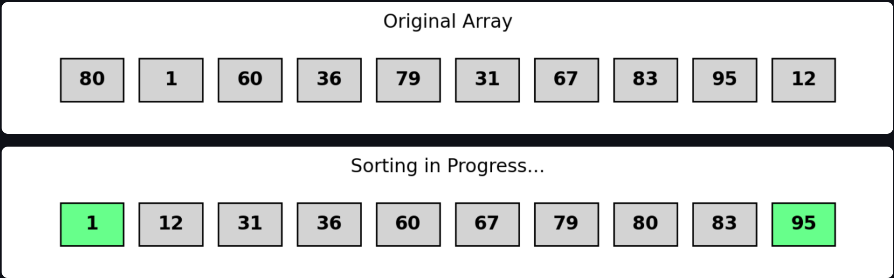
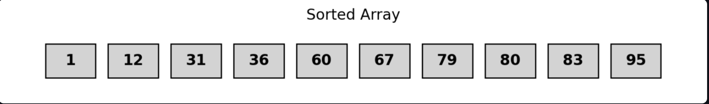
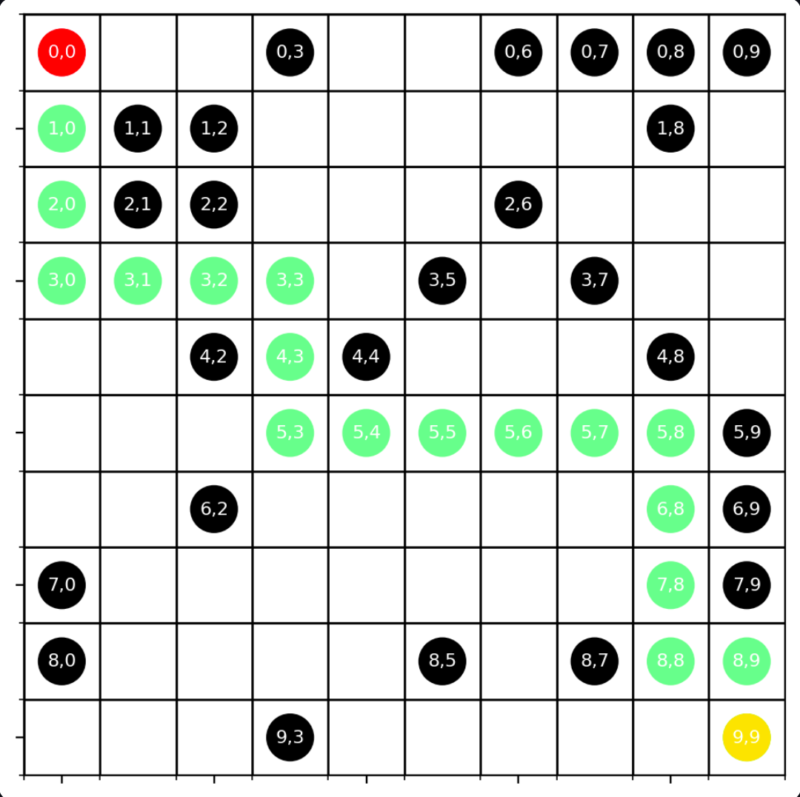

# Algorithm Visualizer

## 📌 Overview
Algorithm Visualizer is a web application built with Streamlit that allows users to visualize sorting and pathfinding algorithms interactively. This tool helps users understand how different algorithms work step-by-step.

## 🎥 Demo
### 🔢 Sorting Algorithm Visualization



### 🛤️ Pathfinding Algorithm Visualization


## 🚀 Features
- Interactive visualization of sorting algorithms (Bubble Sort, Merge Sort, Quick Sort, etc.).
- Pathfinding algorithm simulations (DFS, BFS, A*, Dijkstra’s Algorithm).
- Dynamic updates with animations.
- Randomized input generation for better experimentation.
- Docker support for easy deployment.

## 🛠️ Installation

### 1️⃣ Clone the repository
```sh
git clone https://github.com/yourusername/algorithm-visualizer.git
cd algorithm-visualizer
```

### 2️⃣ Install dependencies
```sh
pip install -r requirements.txt
```

### 3️⃣ Run the application
```sh
streamlit run app.py
```

## 🐳 Running with Docker

### 1️⃣ Build the Docker image
```sh
docker build -t algorithm-visualizer .
```

### 2️⃣ Run the container
```sh
docker run -p 8501:8501 algorithm-visualizer
```

## 📜 File Structure
```
algorithm-visualizer/
│── app.py               # Main Streamlit application
│── requirements.txt     # Dependencies
│── Dockerfile           # Docker container setup
│── Readme.md            # Project documentation
│── images/              # Folder for storing images
│   ├── A*algorithm.png  # A* algorithm visualization
│   ├── QuickSort.png    # Quick Sort visualization step 1
│   ├── QuickSort2.png   # Quick Sort visualization step 2
│── algorithms/
│   ├── sorting.py       # Sorting algorithms and visualization
│   ├── pathfinding.py   # Pathfinding algorithms and visualization
```

## 📈 Algorithms Included
### Sorting Algorithms:
✅ Selection Sort  
✅ Bubble Sort  
✅ Insertion Sort  
✅ Merge Sort  
✅ Quick Sort  
✅ Heap Sort  

### Pathfinding Algorithms:
✅ Depth-First Search (DFS)  
✅ Breadth-First Search (BFS)  
✅ A* Algorithm  
✅ Dijkstra’s Algorithm  

## 👨‍💻 Contribution
Feel free to submit pull requests or suggest new features.

## 📄 License
This project is open-source and available under the MIT License.

---
🚀 **Happy Coding!** 🚀

